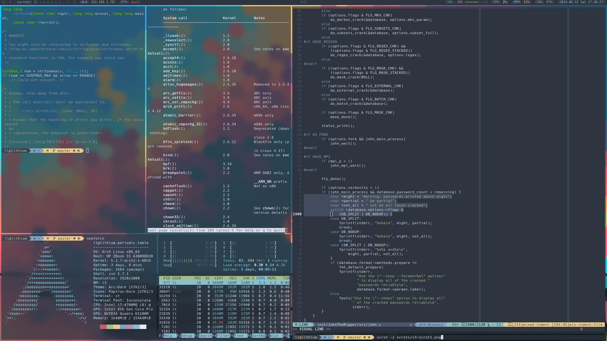
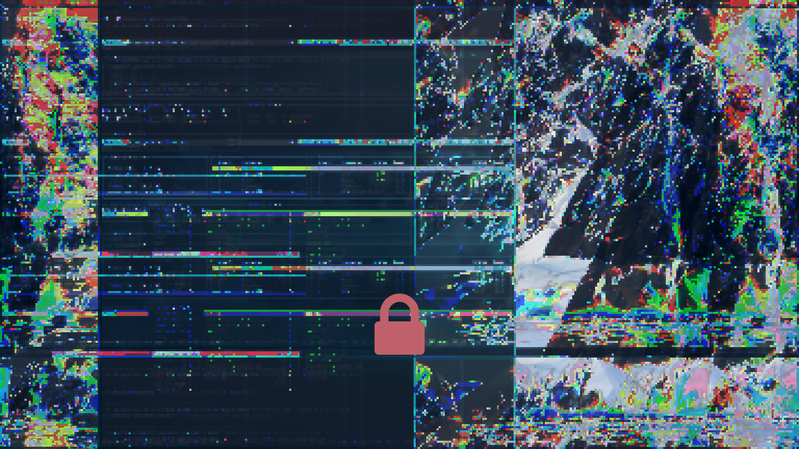

# XZVF's Dotfiles

## Programs & Tools Used
- i3-gaps:xorg@Arch Linux
- polybar
- my [st build](https://github.com/x-zvf/st)
- doom emacs
- neovim
- powerlevel9k:oh-my-zsh@zsh
- compton-tyrone
- ranger
- i3lock
- sox
- imagemagick

## Install
It's best to use GNU stow.

# scripts
the scripts folder contains:
- a modified version of autoname_workspaces.py
- a polybar launcher
- a screen lock script
- hotspot setup
- and more

# Wallpaper
[this one](https://i.redd.it/59bsn5hgnojy.jpg)

## HAPPY RICING!
