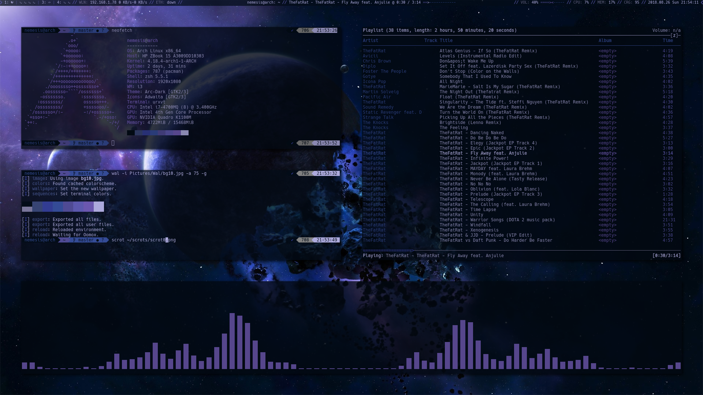
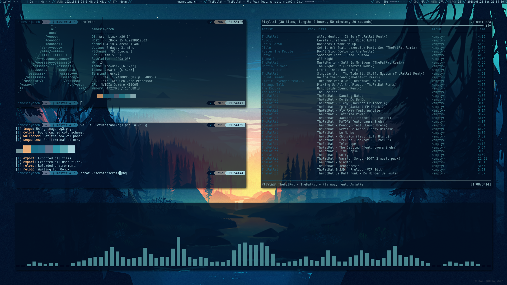

# Octalgon's Dotfiles

##Goal
The goal of this rice is for it to be completely controlled by pywal, so that adjusting the theme is just a single command away.

##Programs & Tools Used
- i3-gaps:xorg@Arch Linux
- polybar
- urxvt
- mpd
- pywal
- spacemacs
- nvim
- powerlevel9k:oh-my-zsh@zsh
- oomox OR arc theme
- compton
- ranger
- ncmpcpp
- cava

#Install
0. Install an arch install with a non-root user and the tools above
1. copy the dotfiles. (Paths in the repo are relative to ~/)
2.run `wal -i path/to/your/wallpaper -a 75 -g` where -a sets the urxvt opacity and -g is used for oomox 

# change theme
The color sheme is completely controlled by pywal, so:

0. run `wal -i path/to/your/new/wallpaper -a 75 -g`
1. reload i3 with Super+Shift+R (This is just so polybar restarts. You could also just run the scripts/polybar-launcher.sh 
manually)

#scripts
the scripts folder contains:
- a modified version of autoname_workspaces.py
- a polybar launcher

#Quirks/Bugs
- The MPD module for polybar doesn't display `format-online-prefix`. I have made an issue for that.

#Todo
- spacemacs
- nvim
- ranger
- a form of screen lock
- add some comments

## HAPPY RICING!
