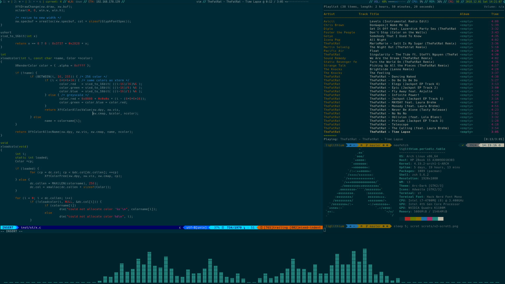
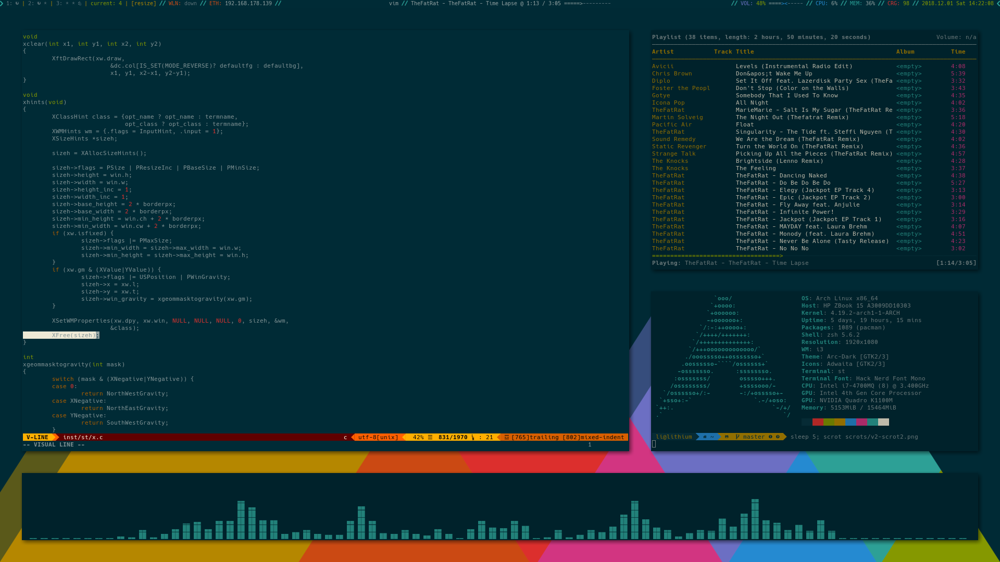

# XZVF's Dotfiles Version 2

#### The older rices can be found in _rice-v1_ and _v2_ respectively

## Programs & Tools Used
- i3-gaps:xorg@Arch Linux
- polybar
- my [st build](https://github.com/x-zvf/st)
- mpd
- spacemacs
- nvim
- powerlevel9k:oh-my-zsh@zsh
- arc theme
- compton
- ranger
- ncmpcpp
- cava
- i3lock-fancy

## Install
0. Install an arch install with a non-root user and the tools above
1. Copy the dotfiles. (Paths in the repo are relative to ~/)

# scripts
the scripts folder contains:
- a modified version of autoname_workspaces.py
- a polybar launcher
- a screen lock script

# Wallpaper
Wal/bg-solarized.png - Solarized Mountains by Thefan Sunjaya from Simple Desktops. The original link no longer exists, but [here](http://i.imgur.com/JKDsRHa.png)'s an imgur link.

# Todo
- spacemacs
- nvim
- ranger
- a form of screen lock
- add some comments

## HAPPY RICING!
